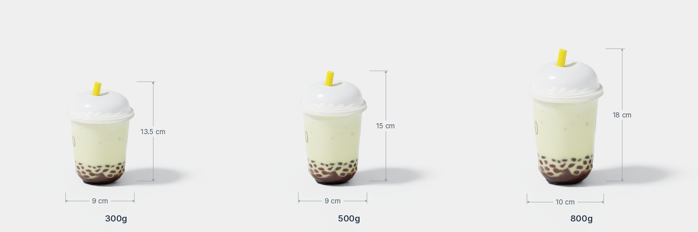
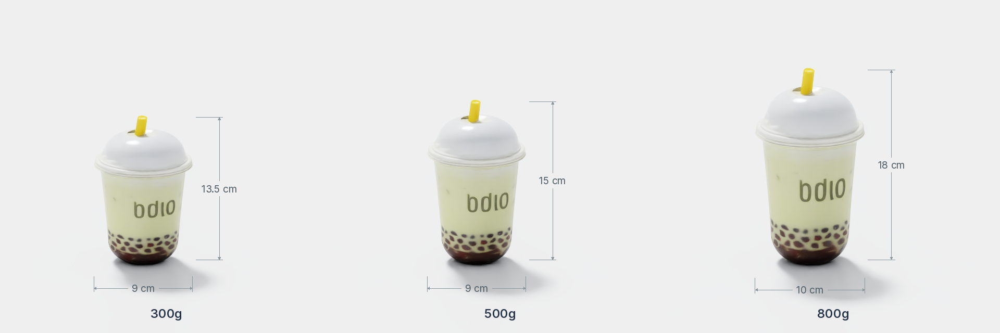
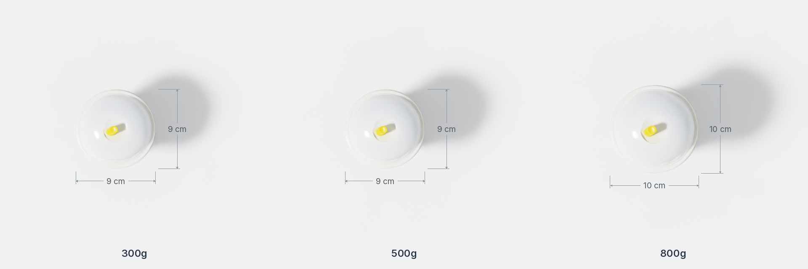

<p class="page-kicker">ASSET / 刚体资产</p>

# 奶茶杯 · bubble_tea_cup

奶茶杯提供 **300g、500g、800g** 三个尺寸规格，用于[最大物体抓取与放置](../tasks/largest_pick_and_place.md)任务。每个规格均包含独立的 USD 资产、物理属性元数据和各机械臂的抓取姿态文件。

## 不同尺寸展示

=== "正面 · 宽度 / 高度"

    [](objects/bubble_tea_cup/front.png)

=== "侧面 · 深度 / 高度"

    [](objects/bubble_tea_cup/side.png)

=== "俯视图 · 宽度 / 深度"

    [](objects/bubble_tea_cup/top.png)

*从左至右为 300g、500g、800g。图片由 Isaac Sim 加载实际资产后渲染，正面与侧面略微俯视，保留地面阴影。尺寸单位为 cm，高度包含吸管。点击图片可查看原图。*

正面从 −Y 一侧、侧面从 +X 一侧向下俯视 16°，俯视图从 +Z 看向 −Z。所有规格使用相同的正交相机比例；尺寸取自 USD 可见几何体的包围盒，高度标线按实际相机角度投影，标注值为物理高度。

| 规格 | 尺寸 X × Y × Z（cm） | 相对 300g 的尺寸比 X / Y / Z |
| --- | --- | --- |
| 300g | 9 × 9 × 13.5 | 1.000 / 1.000 / 1.000 |
| 500g | 9 × 9 × 15 | 1.000 / 1.000 / 1.111 |
| 800g | 10 × 10 × 18 | 1.111 / 1.111 / 1.333 |

规格名称对应质量；尺寸取自各目录的 `metadata.json`，上表按可读精度取整。尺寸比由元数据计算，各轴并非等比变化。资产已保存为对应尺寸的独立 USD，当前任务加载时不再额外设置 `scale`。

### 重新生成图片

在已配置 Isaac Sim 的环境中，从仓库根目录运行：

```bash
uv run python scripts/render_asset_views.py \
  Assets/Object/Rigid/bubble_tea_cup/300g/Aligned.usd \
  Assets/Object/Rigid/bubble_tea_cup/500g/Aligned.usd \
  Assets/Object/Rigid/bubble_tea_cup/800g/Aligned.usd \
  --output-dir docs/assets/objects/bubble_tea_cup
```

脚本自动计算取景和标注，输出 `front.png`、`side.png`、`top.png`。新增资产时替换输入文件和输出目录即可；可用 `--panel-size 960` 提高单个资产面板的分辨率。渲染需要 GPU，应在沙箱外运行。

## 物理属性

### 资产配置

资产根目录为 `Assets/Object/Rigid/bubble_tea_cup/`。以下数值来自各规格的 `metadata.json` 和 `Aligned.usd`，质量与尺寸省略浮点存储误差。

| 属性 | 300g | 500g | 800g |
| --- | --- | --- | --- |
| 尺寸 `physics.size`（m） | 0.09 × 0.09 × 0.135 | 0.09 × 0.09 × 0.15 | 0.10 × 0.10 × 0.18 |
| 质量 `physics.mass`（kg） | 0.3 | 0.5 | 0.8 |
| 摩擦系数 `physics.friction` | 1.0 | 1.0 | 1.0 |
| USD 静摩擦 / 动摩擦系数 | 1.0 / 1.0 | 1.0 / 1.0 | 1.0 / 1.0 |
| 碰撞近似 | 凸分解 | 凸分解 | 凸分解 |

三个 USD 均使用米制（`metersPerUnit = 1`）、Z 轴朝上，碰撞已启用，碰撞近似配置为 `convexDecomposition`。

### 任务运行时配置

当前[最大物体抓取与放置](../tasks/largest_pick_and_place.md)任务从元数据读取质量，并将 `friction` 同时用于静摩擦和动摩擦。其余物理参数由 `configs/tasks/largest_pick_and_place.yml` 的 `physics` 字段统一设置，三个规格相同：

| 参数 | 配置值 |
| --- | --- |
| 恢复系数 `restitution` | 0.0 |
| 线性阻尼 `linear_damping` | 0.10 |
| 角阻尼 `angular_damping` | 0.10 |
| 休眠阈值 `sleep_threshold` | 0.005 |
| 稳定化阈值 `stabilization_threshold` | 0.001 |

## 抓取姿态数据状态

**核对日期：2026-09-25。** 按每个规格、每种机械臂 **1024 条**的标准统计。下列六个文件均已通过项目的 `load_asset_grasps` 加载，数量为通过配置校验并匹配相应机械臂的候选数。

| 规格 | 机械臂 | 已有 / 目标 | 状态 |
| --- | --- | --- | --- |
| 300g | Piper | 1024 / 1024 | 已达标 |
| 300g | ARX X5 | 548 / 1024 | 尚缺 476 条 |
| 500g | Piper | 1024 / 1024 | 已达标 |
| 500g | ARX X5 | 587 / 1024 | 尚缺 437 条 |
| 800g | Piper | 1024 / 1024 | 已达标 |
| 800g | ARX X5 | 68 / 1024 | 尚缺 956 条 |

Piper 三个规格均已达到数量标准。ARX X5 三个规格均需补齐，合计尚缺 **1869 条**，其中 800g 规格尚缺 956 条。

### 文件组织与坐标约定

每个规格目录包含 `Aligned.usd`、`metadata.json`、`textures/`、`grasps-piper.yaml` 和 `grasps-arx-x5.yaml`。运行时根据机械臂配置中的 `name` 读取同目录的 `grasps-<name>.yaml`；ARX X5 对应的配置文件为 `configs/robots/x5.yml`，其中 `name` 为 `arx-x5`。

抓取文件以 `candidates` 保存候选。`pose_object_tcp_xyz_xyzw` 表示 TCP 在物体坐标系中的位姿，顺序为 `[x, y, z, qx, qy, qz, qw]`，位置单位为米；`approach_axis_object` 为物体坐标系中的接近方向，`closed_joint_positions_m` 为闭合时的夹爪关节位置。

数量达标与任务成功率是两个不同指标；这里记录的是抓取数据文件状态，未将加载校验视为仿真抓取成功率验证。资产或抓取文件更新后，应重新加载对应文件并更新本页数量与核对日期。
