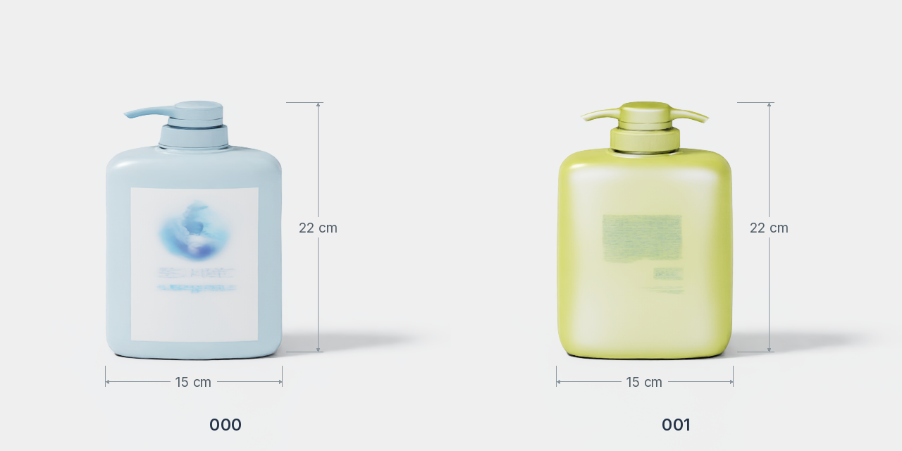
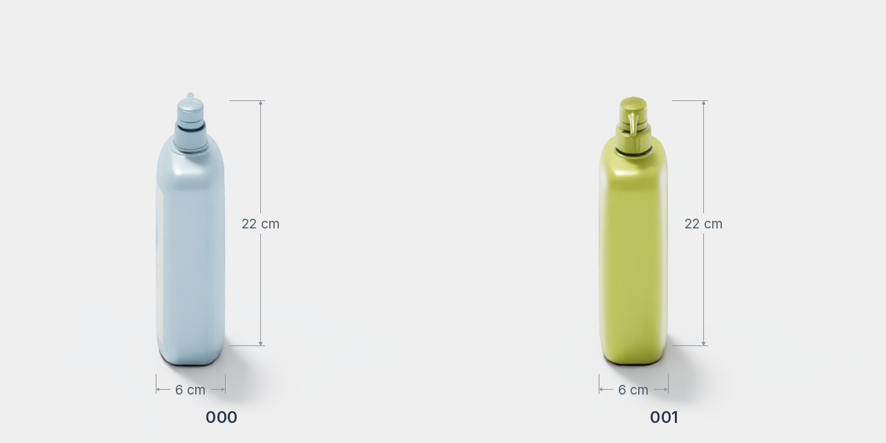
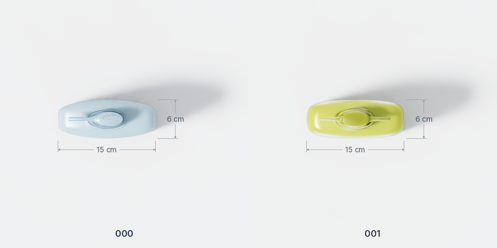

# 洗发水瓶

`shampoo` 提供两种外观，资产目录为 `Assets/Object/Rigid/shampoo/<编号>/`。每个目录包含 `Aligned.usd`、`metadata.json` 和 `textures/`。

## 外观与规格

=== "正面"

    

=== "侧面"

    

=== "俯视图"

    

| 编号 | 宽 × 深 × 高（cm） | 质量（kg） |
| --- | --- | --- |
| 000、001 | 15 × 6 × 22 | 1.0 |

尺寸与质量取自 `metadata.json`。

## 抓取数据

核对日期：2026-10-03。两个规格均未提供抓取文件，专家采集前需补齐所选机器人的[抓取数据](index.md#grasps)。
