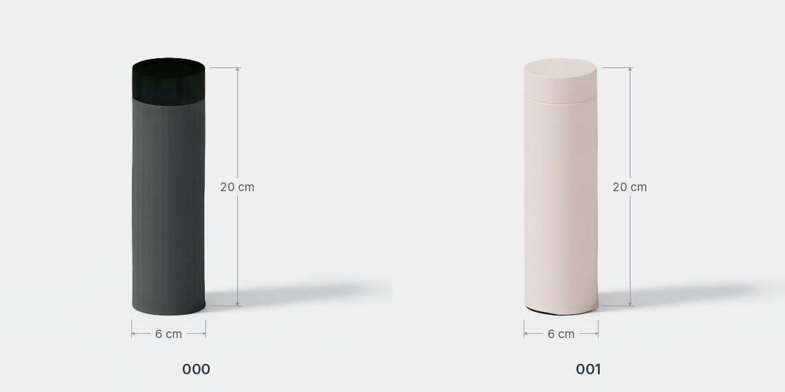
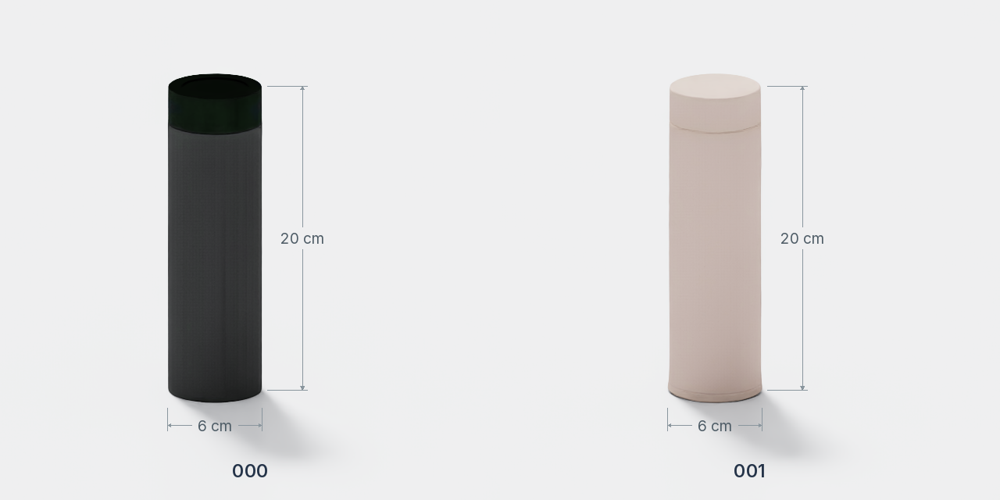
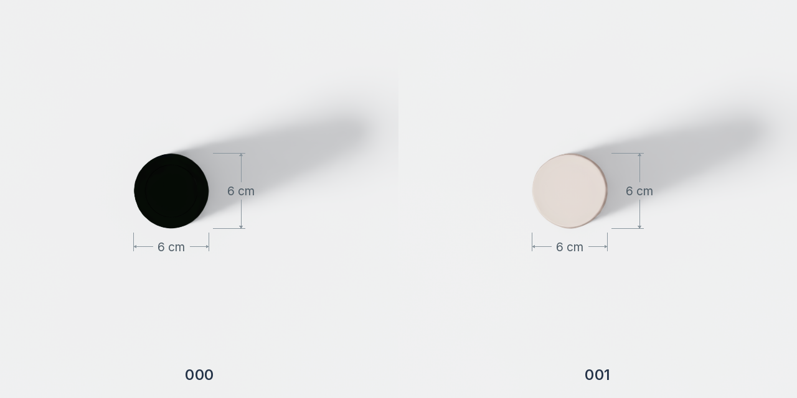

# 保温杯

`thermos_cup` 提供两种外观，资产目录为 `Assets/Object/Rigid/thermos_cup/<编号>/`。每个目录包含 `Aligned.usd`、`metadata.json`、`textures/` 和抓取文件。

## 外观与规格

=== "正面"

    

=== "侧面"

    

=== "俯视图"

    

| 编号 | 宽 × 深 × 高（cm） | 质量（kg） |
| --- | --- | --- |
| 000、001 | 6 × 6 × 20 | 0.1 |

尺寸与质量取自 `metadata.json`。

## 抓取数据

核对日期：2026-10-03。

| 编号 | Piper | ARX X5 |
| --- | --- | --- |
| 000 | 1024 | 1024 |
| 001 | 1024 | 1024 |
